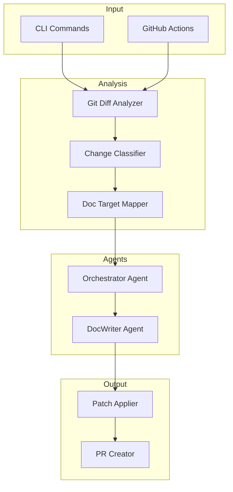

<div align="center">

# 📝 DocPilot

**Automated documentation PR generator powered by GitHub Copilot**

[](https://dotnet.microsoft.com/)
[](LICENSE)
[](https://github.com/yldgio/docpilot/releases)

[Installation](#-installation) • [Quick Start](#-quick-start) • [Documentation](docs/) • [Contributing](CONTRIBUTING.md)

</div>

---

DocPilot analyzes your code changes and automatically generates documentation updates, creating pull requests to keep your docs in sync with your code. It eliminates "doc drift" by ensuring documentation evolves alongside your codebase.

## ✨ Features

- 🔍 **Smart Analysis** — Analyzes git diffs to identify documentation-worthy changes
- 🤖 **AI-Powered** — Uses GitHub Copilot SDK to generate contextual documentation
- 🎯 **Confidence Scoring** — Rates suggestions by confidence level (high/medium/low)
- 🔄 **GitHub Integration** — Creates PRs automatically via GitHub Actions
- 📊 **Mermaid Diagrams** — Auto-generates architecture and flow diagrams
- ⚙️ **Configurable** — Customize behavior with `docpilot.yml`

## 📦 Installation

### Option 1: Download Binary (Recommended)

Download the latest release for your platform from [GitHub Releases](https://github.com/yldgio/docpilot/releases):

| Platform | Download |
|----------|----------|
| Windows (x64) | [`docpilot-win-x64.exe`](https://github.com/yldgio/docpilot/releases/latest/download/docpilot-win-x64.exe) |
| Linux (x64) | [`docpilot-linux-x64`](https://github.com/yldgio/docpilot/releases/latest/download/docpilot-linux-x64) |
| macOS (x64) | [`docpilot-osx-x64`](https://github.com/yldgio/docpilot/releases/latest/download/docpilot-osx-x64) |

```bash
# Linux/macOS: Make executable and move to PATH
chmod +x docpilot-linux-x64
sudo mv docpilot-linux-x64 /usr/local/bin/docpilot

# Windows: Add to PATH or run directly
# Move docpilot-win-x64.exe to a directory in your PATH
```

### Option 2: Build from Source

```bash
# Prerequisites: .NET 10.0 SDK
git clone https://github.com/yldgio/docpilot.git
cd docpilot
dotnet build -c Release

# Run directly
dotnet run --project src/DocPilot -- --help

# Or install as global tool
dotnet pack src/DocPilot -c Release
dotnet tool install -g --add-source src/DocPilot/nupkg DocPilot
```

### Prerequisites

Before using DocPilot, ensure you have:

1. **GitHub Copilot CLI** installed and authenticated:
   ```bash
   # Install GitHub Copilot CLI
   gh extension install github/gh-copilot
   
   # Authenticate
   gh auth login
   gh copilot --version  # Verify installation
   ```

2. **GitHub Token** (for `pr` command): Set `GITHUB_TOKEN` environment variable with `repo` and `pull_request` scopes.

## 🚀 Quick Start

### 1. Analyze Your Changes

```bash
# Analyze staged changes
docpilot analyze --staged

# Analyze changes between commits
docpilot analyze --base main --head feature-branch

# Output as text (default is JSON)
docpilot analyze --staged --output text
```

**Example output:**
```
=== DocPilot Analysis ===

Files changed: 3
Lines added: +127
Lines deleted: -15

Change type: Feature
Overall confidence: High (85%)

Documentation targets:
  - docs/api/authentication.md
    Section: ## OAuth Flow
    Confidence: High (92%)
    Sources: src/Auth/OAuthHandler.cs, src/Auth/TokenService.cs
```

### 2. Generate Documentation

```bash
# Preview changes (dry-run)
docpilot generate --staged --dry-run

# Apply documentation patches
docpilot generate --staged
```

### 3. Create a Pull Request

```bash
# Create docs PR targeting main branch
docpilot pr --target-branch main

# Create as draft PR
docpilot pr --target-branch main --draft

# Custom title
docpilot pr --target-branch main --title "docs: update API reference"
```

## 📖 Commands Reference

| Command | Description |
|---------|-------------|
| `docpilot analyze` | Analyze code changes and identify documentation targets |
| `docpilot generate` | Generate documentation patches based on analysis |
| `docpilot pr` | Create a documentation pull request |

For detailed options, run `docpilot <command> --help`.

<details>
<summary><strong>docpilot analyze</strong> — Full options</summary>

```
Options:
  -b, --base <commit>     Base commit/branch for comparison
  -h, --head <commit>     Head commit/branch for comparison  
  -s, --staged            Analyze staged changes only
  -o, --output <format>   Output format: json, text (default: json)
  -c, --config <path>     Path to docpilot.yml
```
</details>

<details>
<summary><strong>docpilot generate</strong> — Full options</summary>

```
Options:
  -b, --base <commit>     Base commit/branch for comparison
  -h, --head <commit>     Head commit/branch for comparison
  -s, --staged            Analyze staged changes only
  -n, --dry-run           Preview changes without applying
  -t, --target <path>     Target directory for generated docs
  -c, --config <path>     Path to docpilot.yml
```
</details>

<details>
<summary><strong>docpilot pr</strong> — Full options</summary>

```
Options:
  -t, --target-branch     Target branch for PR (default: main)
  -d, --draft             Create as draft PR
  --title <title>         Custom PR title
  -c, --config <path>     Path to docpilot.yml
```
</details>

## ⚙️ Configuration

Create a `docpilot.yml` file in your repository root to customize behavior:

```yaml
# Heuristic rules for mapping code changes to documentation
heuristics:
  rules:
    - pattern: "src/Api/**/*.cs"
      target: "docs/api/{filename}.md"
      section: "## API Reference"
      
    - pattern: "src/Services/**/*.cs"
      target: "docs/architecture.md"
      section: "## Services"
      
    - pattern: "*.csproj"
      target: "docs/getting-started.md"
      section: "## Dependencies"

# Path restrictions (docs-only guardrail)
paths:
  allowlist:
    - "docs/**"
    - "*.md"
    - "README.md"

# Processing limits
limits:
  maxFiles: 50
  maxLinesPerFile: 1000
```

See [docs/configuration.md](docs/configuration.md) for full configuration reference.

## 🔄 GitHub Actions Integration

Automate documentation updates on every pull request:

```yaml
# .github/workflows/docpilot.yml
name: DocPilot

on:
  pull_request:
    types: [opened, synchronize, reopened]
    paths-ignore:
      - 'docs/**'
      - '*.md'

jobs:
  docpilot:
    runs-on: ubuntu-latest
    permissions:
      contents: write
      pull-requests: write
      
    steps:
      - uses: actions/checkout@v4
        with:
          fetch-depth: 0
          
      - name: Download DocPilot
        run: |
          curl -L https://github.com/yldgio/docpilot/releases/latest/download/docpilot-linux-x64 -o docpilot
          chmod +x docpilot
          
      - name: Generate Documentation PR
        run: ./docpilot pr --base ${{ github.event.pull_request.base.sha }} --head ${{ github.event.pull_request.head.sha }}
        env:
          GITHUB_TOKEN: ${{ secrets.GITHUB_TOKEN }}
```

## 🏗️ Architecture

DocPilot uses a multi-agent architecture powered by GitHub Copilot SDK:



| Component | Description |
|-----------|-------------|
| **Orchestrator Agent** | Coordinates analysis, invokes tools, manages workflow |
| **DocWriter Agent** | Generates markdown content with Mermaid diagrams |
| **Patch Applier** | Applies create/update/append operations to files |
| **PR Creator** | Creates GitHub PRs with proper metadata |

## 📊 Confidence Scoring

DocPilot assigns confidence scores based on heuristic matching:

| Level | Score | Behavior |
|-------|-------|----------|
| 🟢 High | > 80% | Creates PR with `ready-for-review` label |
| 🟡 Medium | 50-80% | Creates normal PR |
| 🔴 Low | < 50% | Creates **draft** PR for manual review |

## 🛠️ Development

```bash
# Clone and build
git clone https://github.com/yldgio/docpilot.git
cd docpilot
dotnet build

# Run tests
dotnet test

# Run with hot reload
dotnet watch run --project src/DocPilot -- analyze --staged
```

### Project Structure

```
docpilot/
├── src/DocPilot/
│   ├── Agents/          # Copilot SDK agents and tools
│   ├── Analysis/        # Git diff analysis
│   ├── Commands/        # CLI command handlers
│   ├── Configuration/   # YAML config parsing
│   ├── Generation/      # Patch generation and application
│   ├── GitHub/          # PR creation with Octokit
│   ├── Heuristics/      # Change classification
│   └── Pipeline/        # Orchestration pipeline
├── tests/DocPilot.Tests/
├── docs/
└── samples/
```

## 📄 License

MIT License — see [LICENSE](LICENSE) for details.

## 🤝 Contributing

Contributions are welcome! Please read our [Contributing Guide](CONTRIBUTING.md) for details on:

- Code of conduct
- Development setup
- Pull request process
- Coding standards

---

<div align="center">

**[⬆ Back to top](#-docpilot)**

Made with ❤️ by the DocPilot contributors

</div>
