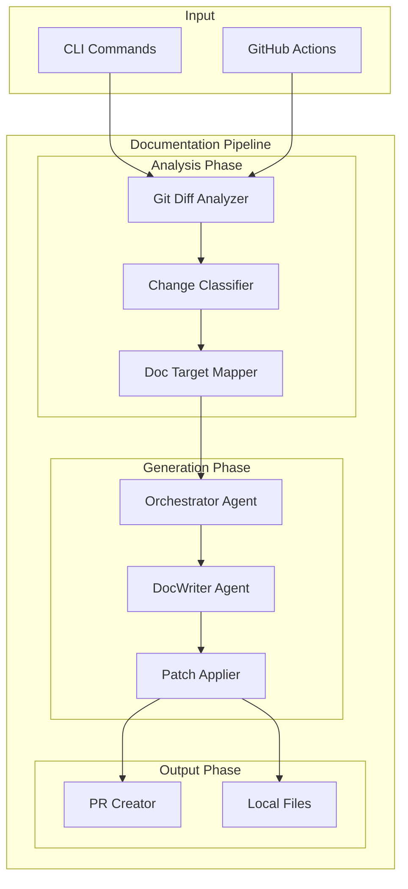

# Architecture

This document describes the internal architecture of DocPilot.

## Overview

DocPilot is a multi-agent system that analyzes code changes and generates documentation updates. It's built on the GitHub Copilot SDK and uses a pipeline architecture.



## Core Components

### 1. CLI Layer (`Commands/`)

Entry point for all DocPilot operations.

| Command | Handler | Description |
|---------|---------|-------------|
| `analyze` | `AnalyzeCommand` | Analyze changes and identify doc targets |
| `generate` | `GenerateCommand` | Generate documentation patches |
| `pr` | `PrCommand` | Create GitHub pull request |

```csharp
// Command structure
public static class AnalyzeCommand
{
    public static Command Create()
    {
        var command = new Command("analyze", "Analyze code changes");
        command.SetHandler(async (context) => {
            var pipeline = new DocumentationPipeline(repoPath, config);
            var result = await pipeline.RunAnalyzeAsync(baseRef, headRef, staged);
        });
        return command;
    }
}
```

### 2. Analysis Layer

#### Git Diff Analyzer (`Analysis/DiffAnalyzer.cs`)

Uses LibGit2Sharp to extract changes between commits.

```csharp
public class DiffAnalyzer
{
    public DiffResult AnalyzeRange(string baseRef, string headRef);
    public DiffResult AnalyzeStaged();
    public DiffResult AnalyzeWorkingDirectory();
}
```

**Output:**
- List of changed files with change type (Add, Modify, Delete, Rename)
- Line-by-line diffs (hunks)
- Statistics (lines added/deleted)

#### Change Classifier (`Heuristics/ChangeClassifier.cs`)

Categorizes changes based on patterns.

```csharp
public enum ChangeType
{
    Feature,    // New functionality
    Bugfix,     // Bug fixes
    Refactor,   // Code restructuring
    Breaking,   // Breaking changes
    Docs,       // Documentation only
    Chore       // Maintenance
}
```

#### Doc Target Mapper (`Heuristics/DocTargetMapper.cs`)

Maps changed files to documentation targets using configured heuristics.

```csharp
public class DocTargetMapper
{
    public MappingResult MapToDocTargets(DiffResult diff);
}

public class DocTarget
{
    public string FilePath { get; }       // e.g., "docs/api/users.md"
    public string? Section { get; }       // e.g., "## Endpoints"
    public ConfidenceLevel Confidence { get; }
    public List<string> SourceFiles { get; }
    public string Rationale { get; }
}
```

### 3. Agent Layer

DocPilot uses the GitHub Copilot SDK to power its AI capabilities.

#### Orchestrator Agent (`Agents/OrchestratorAgent.cs`)

Coordinates the analysis workflow and manages tool execution.

```csharp
public class OrchestratorAgent : IAsyncDisposable
{
    private readonly CopilotClient _client;
    private CopilotSession? _session;
    
    public async Task<OrchestratorResult> AnalyzeAsync(
        string baseRef, 
        string headRef);
}
```

**Available Tools:**
- `analyze_diff` — Analyze git diff between refs
- `analyze_staged` — Analyze staged changes
- `map_doc_targets` — Map changes to documentation targets
- `read_file` — Read file contents for context

#### DocWriter Agent (`Agents/DocWriterAgent.cs`)

Generates documentation content.

```csharp
public class DocWriterAgent : IAsyncDisposable
{
    public async Task<WriterResult> GenerateAsync(MappingResult mapping);
}
```

**Available Tools:**
- `generate_doc_patch` — Create documentation patch
- `validate_mermaid` — Validate Mermaid diagram syntax
- `read_file` — Read existing documentation

### 4. Generation Layer

#### Patch System (`Generation/`)

Represents and applies documentation changes.

```csharp
public enum PatchOperation
{
    Create,  // Create new file
    Update,  // Replace file content
    Append,  // Add to existing file
    Delete   // Remove file
}

public class DocPatch
{
    public string FilePath { get; }
    public PatchOperation Operation { get; }
    public string Content { get; }
    public string? Section { get; }  // For Append operations
}
```

#### Patch Applier (`Generation/PatchApplier.cs`)

Applies patches to the filesystem.

```csharp
public class PatchApplier
{
    public async Task<ApplyResult> ApplyAsync(
        PatchSet patchSet, 
        bool dryRun = false);
}
```

### 5. GitHub Integration (`GitHub/`)

#### PR Creator (`GitHub/PullRequestCreator.cs`)

Creates pull requests using Octokit.

```csharp
public class PullRequestCreator
{
    public async Task<PullRequest> CreateAsync(
        string branchName,
        string title,
        string body,
        bool draft = false);
}
```

**Branch Naming:** `docpilot/{type}-{timestamp}`

**Label Assignment:**
- Confidence > 80%: `ready-for-review`
- Confidence < 50%: Creates draft PR

## Data Flow

### Analysis Flow

```
git diff → DiffAnalyzer → DiffResult
                              ↓
                       ChangeClassifier → ChangeType
                              ↓
                       DocTargetMapper → MappingResult
                              ↓
                       OrchestratorAgent → Analysis complete
```

### Generation Flow

```
MappingResult → DocWriterAgent → DocPatch[]
                                      ↓
                               PatchApplier → Files modified
                                      ↓
                               PullRequestCreator → PR created
```

## Configuration System

Configuration is loaded from `docpilot.yml`:

```csharp
public class DocPilotConfig
{
    public HeuristicsConfig Heuristics { get; }
    public PathsConfig Paths { get; }
    public LimitsConfig Limits { get; }
}

public class ConfigurationLoader
{
    public async Task<DocPilotConfig> LoadAsync(string? path);
}
```

## Error Handling

DocPilot uses a result-based error handling pattern:

```csharp
public class PipelineResult
{
    public bool Success { get; }
    public string? Error { get; }
    public PipelineStage Stage { get; }
    
    // Stage-specific data
    public DiffResult? Diff { get; }
    public MappingResult? Mapping { get; }
    public List<string>? GeneratedFiles { get; }
}
```

## Testing Strategy

### Unit Tests

Each component has dedicated unit tests:

```
tests/DocPilot.Tests/
├── Analysis/
│   └── DiffAnalyzerTests.cs
├── Configuration/
│   └── ConfigurationLoaderTests.cs
├── Generation/
│   └── PatchApplierTests.cs
├── Heuristics/
│   └── ChangeClassifierTests.cs
└── Agents/
    └── OrchestratorAgentTests.cs
```

### Integration Tests

End-to-end tests use real git repositories:

```bash
dotnet test --filter "Category=Integration"
```

## Extension Points

### Custom Heuristics

Add rules in `docpilot.yml`:

```yaml
heuristics:
  rules:
    - pattern: "custom/path/**/*.js"
      target: "docs/custom.md"
```

### Custom Tools

Extend agents with new tools:

```csharp
AIFunctionFactory.Create(
    ([Description("Custom tool")] string input) => {
        return ProcessCustom(input);
    },
    "custom_tool",
    "Description of custom tool"
);
```

## Performance Considerations

- **Streaming:** DocWriter uses streaming responses for incremental feedback
- **Limits:** Configurable `maxFiles` and `maxLinesPerFile` prevent overload
- **Caching:** DiffResult is computed once and shared across tools
- **Parallel:** Multiple independent patches can be applied concurrently

## Dependencies

| Package | Purpose |
|---------|---------|
| `GitHub.Copilot.SDK` | AI agent sessions and tool calling |
| `System.CommandLine` | CLI argument parsing |
| `LibGit2Sharp` | Git diff analysis |
| `YamlDotNet` | Configuration parsing |
| `Octokit` | GitHub API |
| `Microsoft.Extensions.AI` | Tool factory utilities |

## See Also

- [Getting Started](getting-started.md)
- [Configuration Reference](configuration.md)
- [GitHub Actions](github-actions.md)
